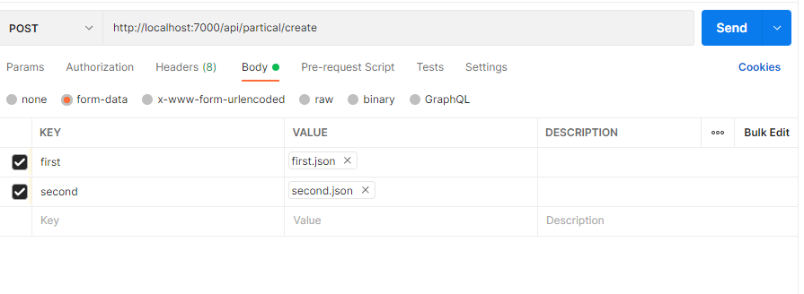

###Prerequisites:

1. node
2. mongodb
3. npm
4. (optional) Postman 
5. (optional) MongoDBCompass
____

###Procedure: 

1. Install dependencies
> npm install
2. Run code
> npm run start
3. Make a post request on http://localhost:7000/api/partical/create 
 >key: first, value: first.json
 >key: second, value: second.json

4. Check out the result in Postman respose or in your local db with MongoDBCompass

